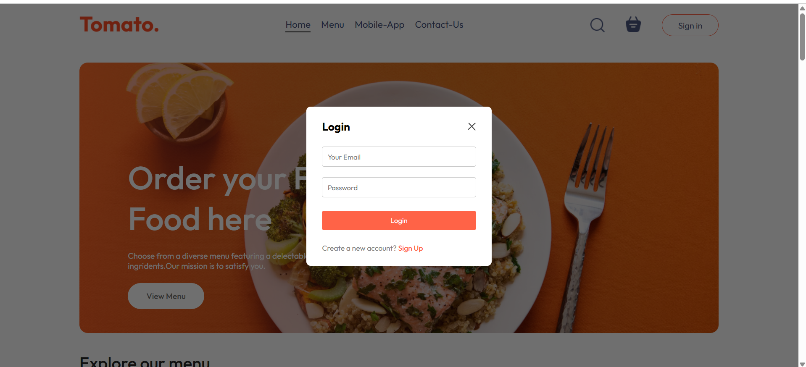
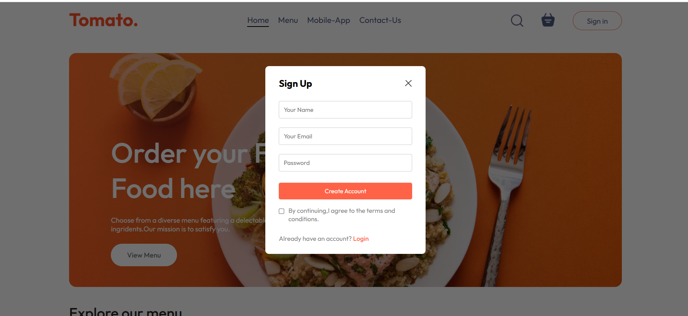
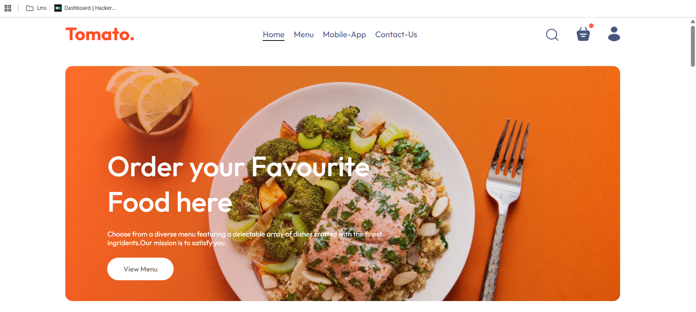
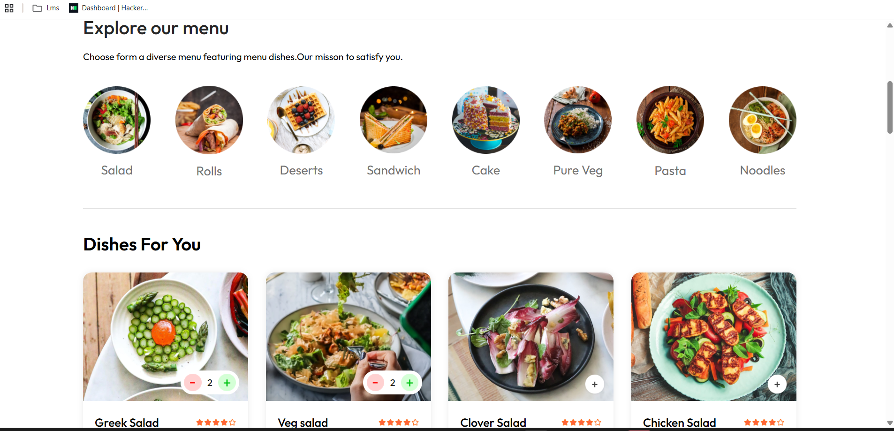
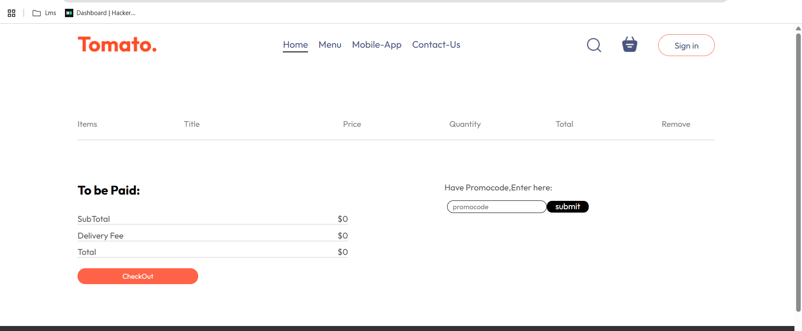
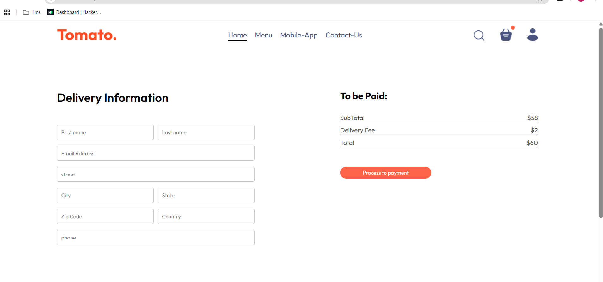
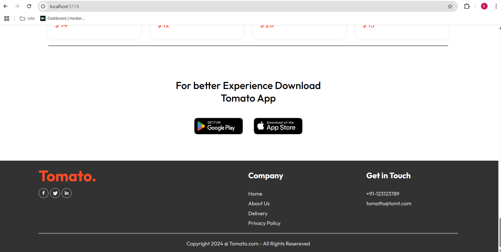
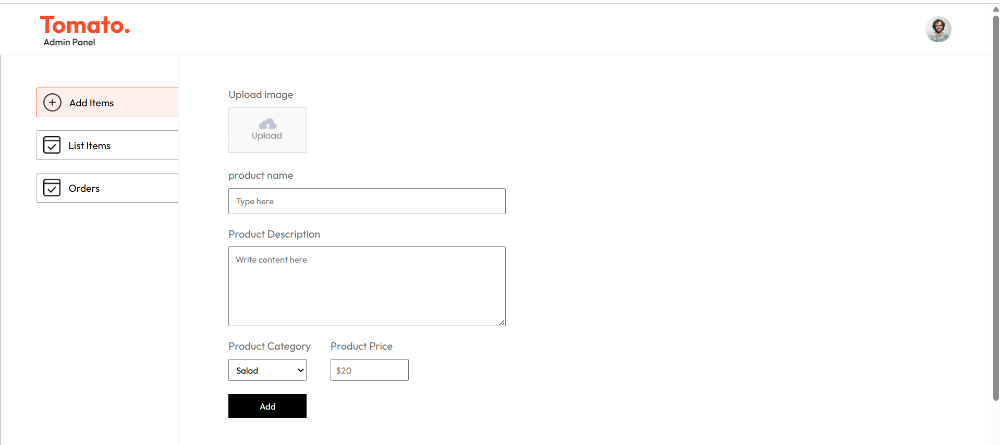
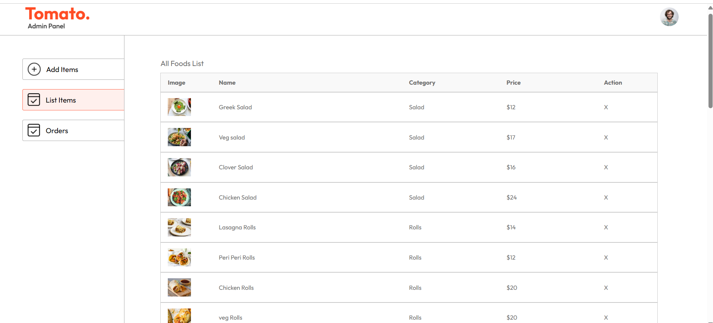
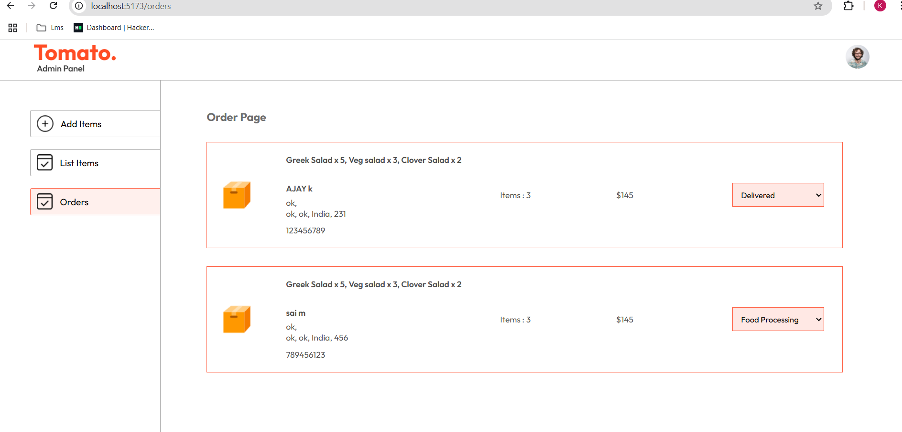

# 🍔 MERN Stack Food Ordering App

A full-stack food ordering application built with the MERN stack (MongoDB, Express, React, Node.js).

---

## 📸 Screenshots

### 🔐 Frontend Pages

#### ✅ Login

#### ✅ Signup

#### 🏠 Home

#### 🍽️ Explore

#### 🛒 Cart

#### 📦 Checkout

#### 📄 Footer

---

### 🛠️ Admin Panel

#### ➕ Add Item

#### 📋 List Items

#### 📦 Orders

---

## 🚀 Features

### 🧑‍💻 User Side:
- User authentication (login/signup)
- Browse food items (Explore/Home)
- Add to cart & update cart items
- Checkout with delivery form
- Online payment integration (Stripe or similar)

### 🛠️ Admin Side:
- Admin login (optional protected route)
- Add/edit/delete food items
- View all orders placed

---

## 🧱 Tech Stack

- **Frontend:** React, Axios, React Router
- **Backend:** Node.js, Express.js
- **Database:** MongoDB (Mongoose)
- **Authentication:** JWT Tokens (stored in localStorage)
- **Payment Gateway:** Stripe (or placeholder)
- **Styling:** CSS modules

---

